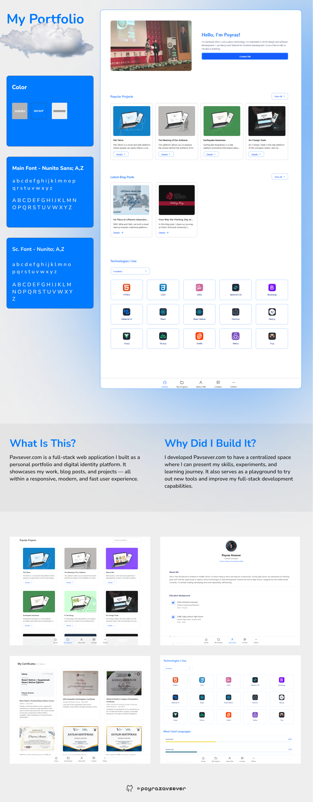

<p align="center">
  
</p>

# Poyraz Avsever Portfolio

A modern, multi-language portfolio website built with [Next.js](https://nextjs.org), [Tailwind CSS](https://tailwindcss.com), and [Supabase](https://supabase.com) for backend services.

---

## 🚀 Features

- **Multi-language support:** Turkish, English, German, Spanish (`/public/locales`)
- **Responsive design:** Mobile-first, dark/light mode
- **Supabase integration:** Real-time database for contact forms and meeting scheduling
- **Modern UI:** Tailwind CSS, animated transitions, iconify icons
- **Freelance & Meeting modules:** Schedule meetings, view freelance services
- **Social links:** Easily accessible social media and references
- **SEO optimized:** Meta tags, Open Graph, and accessibility best practices
- **Content management:** Markdown-based blog and project content
- **Easy deployment:** Vercel-ready

---

## 🛠️ Tech Stack

- **Frontend:** Next.js, React, Tailwind CSS
- **Backend:** Supabase (PostgreSQL, Auth, Storage)
- **Icons:** [Iconify](https://iconify.design/)
- **Internationalization:** next-i18next
- **Animation:** Framer Motion

---

## 📦 Project Structure

```
├── components/         # Reusable React components
├── content/            # Markdown content for blog/projects
├── data/               # Static data (tech stack, projects)
├── lib/                # Supabase client and utilities
├── pages/              # Next.js pages (routes)
├── public/             # Static assets (images, avatar, etc.)
├── styles/             # Global styles
└── ...
```

---

## ⚡ Getting Started

1. **Install dependencies:**
   ```bash
   pnpm install
   # or
   npm install
   # or
   yarn install
   ```
2. **Configure Supabase:**
   - Create a project at [Supabase](https://supabase.com)
   - Copy your Supabase URL and anon key
   - Create a `.env.local` file:
     ```env
     NEXT_PUBLIC_SUPABASE_URL=your-supabase-url
     NEXT_PUBLIC_SUPABASE_ANON_KEY=your-anon-key
     ```
3. **Run the development server:**
   ```bash
   pnpm dev
   # or
   npm run dev
   # or
   yarn dev
   ```
4. **Open [http://localhost:3000](http://localhost:3000) in your browser.**

---

## 📝 Customization

- Update your profile image at `public/avatar.png`
- Edit content in `content/` and `data/`
- Add new languages in `public/locales/`
- Configure Supabase tables for contact/meeting forms

---

## 🌐 Deployment

Deploy easily on [Vercel](https://vercel.com/) or any platform supporting Next.js.

---

## 📄 License

MIT

---

## 🙋‍♂️ Author

**Poyraz Avsever**

- [LinkedIn](https://www.linkedin.com/in/poyrazavsever/)
- [GitHub](https://github.com/poyrazavsever)
- [Portfolio](https://poyrazavsever.com)

---

## 📷 Preview

<p align="center">
  
</p>

---

## 💡 Inspiration

This project is inspired by modern developer portfolios and aims to be a clean, scalable, and easy-to-maintain showcase for personal and professional work.

This is a [Next.js](https://nextjs.org) project bootstrapped with [`create-next-app`](https://nextjs.org/docs/pages/api-reference/create-next-app).

## Getting Started

First, run the development server:

```bash
npm run dev
# or
yarn dev
# or
pnpm dev
# or
bun dev
```

Open [http://localhost:3000](http://localhost:3000) with your browser to see the result.

You can start editing the page by modifying `pages/index.js`. The page auto-updates as you edit the file.

[API routes](https://nextjs.org/docs/pages/building-your-application/routing/api-routes) can be accessed on [http://localhost:3000/api/hello](http://localhost:3000/api/hello). This endpoint can be edited in `pages/api/hello.js`.

The `pages/api` directory is mapped to `/api/*`. Files in this directory are treated as [API routes](https://nextjs.org/docs/pages/building-your-application/routing/api-routes) instead of React pages.

This project uses [`next/font`](https://nextjs.org/docs/pages/building-your-application/optimizing/fonts) to automatically optimize and load [Geist](https://vercel.com/font), a new font family for Vercel.

## Learn More

To learn more about Next.js, take a look at the following resources:

- [Next.js Documentation](https://nextjs.org/docs) - learn about Next.js features and API.
- [Learn Next.js](https://nextjs.org/learn-pages-router) - an interactive Next.js tutorial.

You can check out [the Next.js GitHub repository](https://github.com/vercel/next.js) - your feedback and contributions are welcome!

## Deploy on Vercel

The easiest way to deploy your Next.js app is to use the [Vercel Platform](https://vercel.com/new?utm_medium=default-template&filter=next.js&utm_source=create-next-app&utm_campaign=create-next-app-readme) from the creators of Next.js.

Check out our [Next.js deployment documentation](https://nextjs.org/docs/pages/building-your-application/deploying) for more details.
